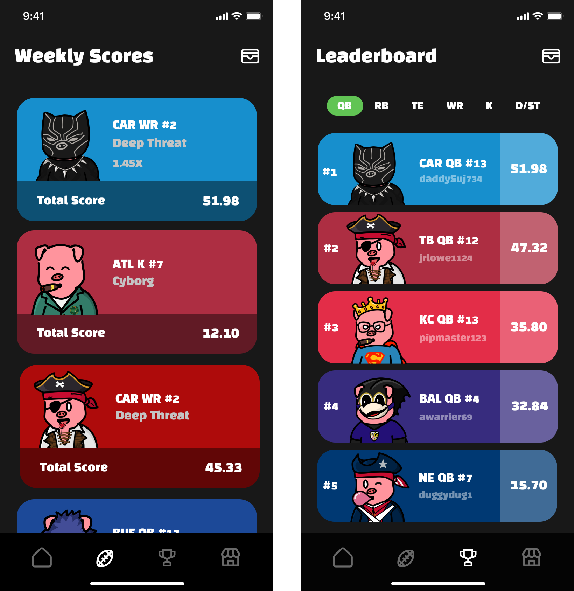

# 📈 Profile and Performance

After connecting your wallet, your profile page will allow you to see your total ETH and PAL tokens. Additionally, we added a C/P button that will allow you to quickly utilize your wallet address from our app.

**Figure C:**  On this screen, you will be able to see your pigskin pals and scroll through them. They will updated automatically as they will always directly reflect the contents of your wallet.

.png>)

**Figure D:** On this screen, you will be able to see the averages for your pigs. They will automatically sort alphabetically by team and position order (QB, RB, WR, TE, K, D/ST). This is the MVP season 1 mockup, but we plan on releasing more fantasy analytics tied to your NFTs.
